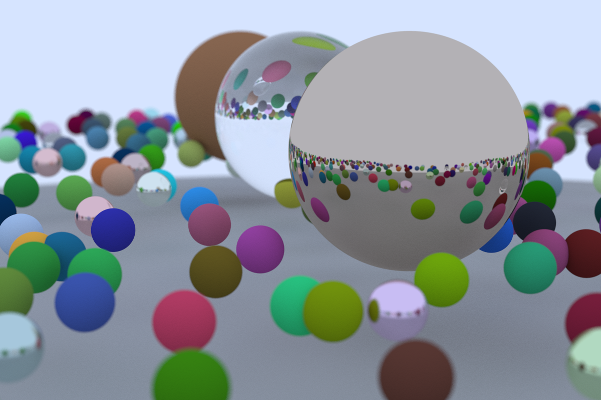
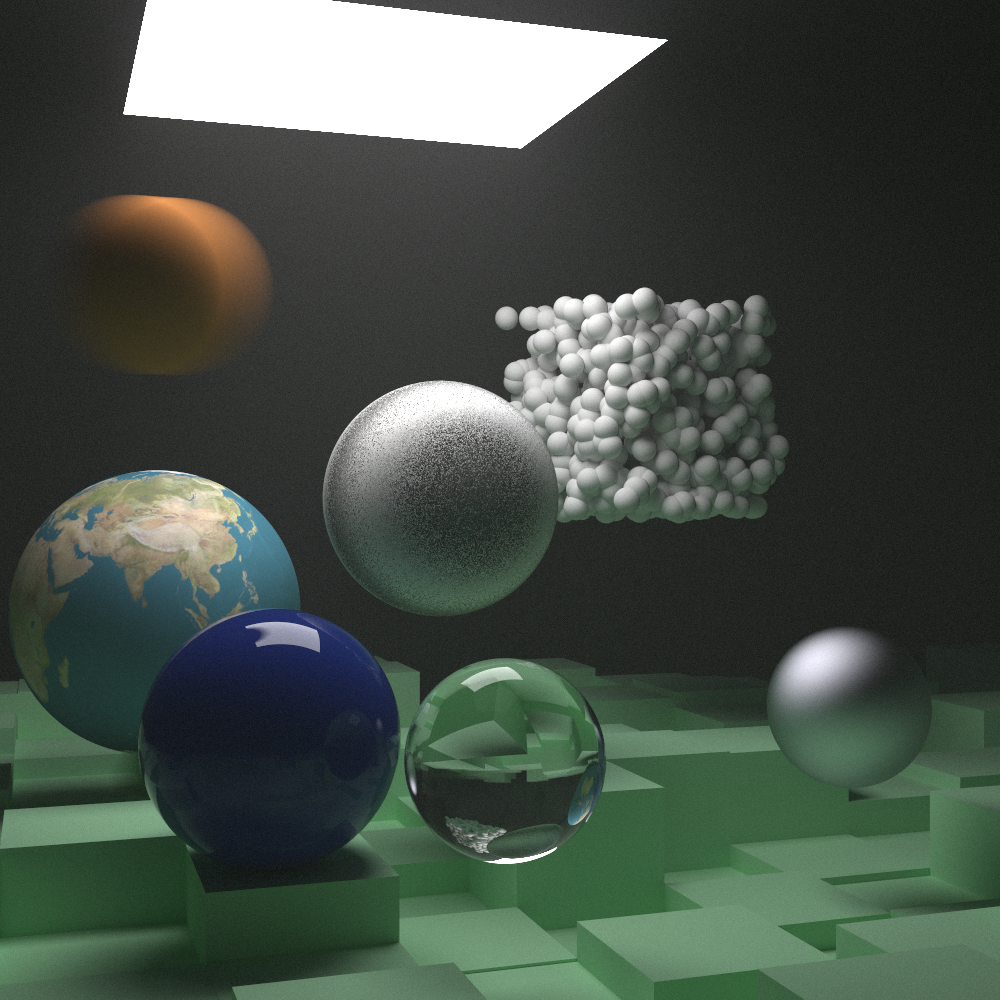
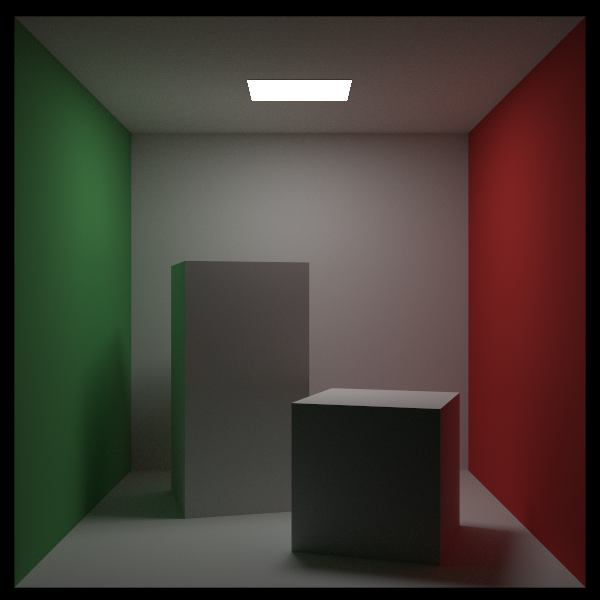

# raytracer

Raytracer written in Rust based on "[Ray Tracing in One Weekend](https://raytracing.github.io/)" books series.

I learned Rust while writing this code so many things could be improved.

## [Ray Tracing in One Weekend](https://raytracing.github.io/books/RayTracingInOneWeekend.html)

Fully implemented.

##  [Ray Tracing: The Next Week](https://raytracing.github.io/books/RayTracingTheNextWeek.html)

Fully implemented.

## [Ray Tracing: The Rest of Your Life](https://raytracing.github.io/books/RayTracingTheRestOfYourLife.html)

In progress.

## Rust specificities

- Use dynamic traits for Texture and Materials.
- Multi-threaded using [rayon](https://docs.rs/rayon/1.5.1/rayon/).

## Todo list

- do real time render using pixels / minifb
- incremental rendering
- update to soo to be released version 4.0.0 of books